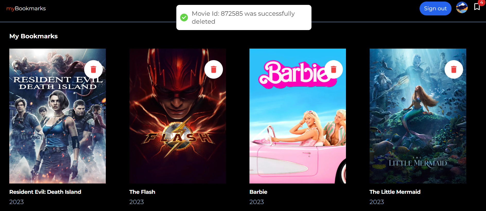

<a name="readme-top"></a>

<!-- PROJECT LOGO -->
<br />
<div align="center">

<h2 align="center">MOVIE-BOOKMARK</h2>
  <p align="center">
    A web app built using Next 13.4 for bookmarking movies, using redux-toolkit and firebase.
    <br/>
    Link:
    <a href="https://dev.to/thankgod/crafting-your-personal-movie-bookmark-application-using-next-13413-redux-toolkit-firebase-and-typescript-2dgj" targer="_blank">
      Creating Your Personal Movie Bookmark Application using Next 13.4.13, Redux Toolkit, Firebase, and TypeScript
    </a>
    <br />
  </p>
</div>


<!-- TABLE OF CONTENTS -->
<details>
  <summary>Table of Contents</summary>
  <ol>
    <li><a href="#tech-stack">Tech Stack</a></li>
    <li><a href="#development">Development</a></li>
  </ol>
</details>
<br/>

<div align="center">
  <a href="https://github.com/Tk-brainCodes/Movie-Bookmark">
    
       
          
   

  </a>
</div>
<br/>

<!-- TECH STACK -->

## Tech Stack

- **Next 13.4** with Typescript
- Styled using **TailwindCSS**
- Authentication, database using **Firebase**
- State management using **Redux-Toolkit**


<p align="right">(<a href="#readme-top">back to top</a>)</p>

<!-- DEVELOPMENT -->

## Development

<br/>


1. Clone the repository 
```sh
git clone https://github.com/Tk-brainCodes/Movie-Bookmark.git
```

2. cd into the `bookmarks` directory
```sh
cd bookmarks/
```
3. Install dependencies using npm
```sh
npm install
```

4. Copy your `firebase config` into `.env-local` and update the variables

5. Start the development server

```sh
npm run dev
```

<p align="right">(<a href="#readme-top">back to top</a>)</p>


